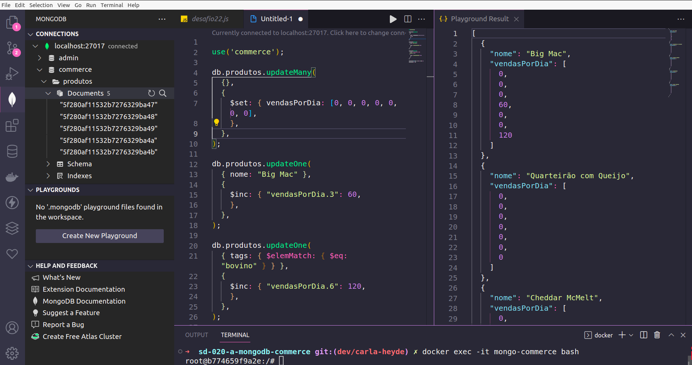

# MongoDB - Commerce   

This Project consists in MQL (Mongo Query Language) queries to get information from a given MongoDB database called Commerce, that holds information from a collection of Products.

This is a back-end Project, part of [Trybe](https://www.betrybe.com/) school requirements to move on in the studies.

<strong>First commit:</strong> on Oct 17, 2022.

<strong>Here I had to exercise:</strong> MongoDB, Docker.




# How to run it:

<details>
 <summary><strong> You need to have installed:</strong></summary><br />
 - Unix based Operational System <br />
 - node version >= 16.14.0 LTS <br />
 - MongoDB Compass or the MongoDB for VS Code Extension
</details>
 

command to install it: `npm install` <br />

Docker commands
  To create a container: 
  `docker run -d --name=nomeDoContainer -v "$PWD:/app" -p 27017:27017 mongo:5.0` <br />
  
  To access the container: 
  `docker exec -it nomeDoContainer bash` <br />
  
command to reset the database: 
`DBNAME=commerce ./scripts/resetdb.sh assets/produtos`


# Files/Folders Ownership

Here you find a list of files and or folders according to the ownership.

<details>
 <summary><strong>🙋‍♀️ I coded myself:</strong></summary><br />
   
  ```markdown  
  challenges/
  README.md
  ```
 
 </details>


<details>
 <summary><strong>🏫 coded by the school:</strong></summary><br />
   
  ```markdown  
   all others not mentioned before.
  ```
 
 </details>
 
 #

✨ all icons used here are from:  [EmojiPedia](https://emojipedia.org/). 

#### 🚧 README under construction 🚧
